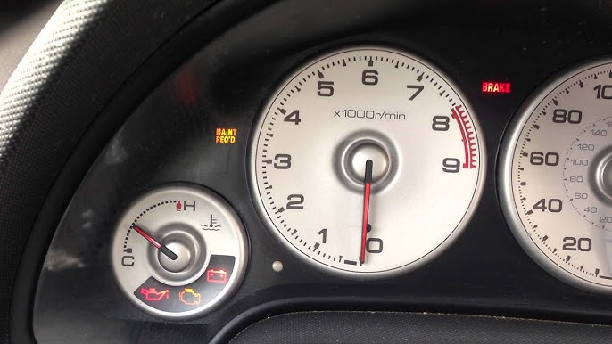
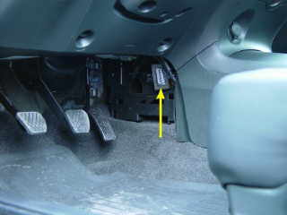

# Yep, it's still there. Now what?
Everyone who's been driving a car for a good amount of time has experienced it: the **check engine light**. If you aren't aware of what the check engine light is, it is a beacon of despair. A harbinger of anxiety and misfortunes to come. In other words, it means your car detected something wrong, but is too shy to tell you what the problem is.

Above you can see what it looks like when my car's check engine light is on, as well as a handful of other diagnostic lights (from Google, not my car luckily). Starting from the top is the maintenance required light. This is a minor inconvenience that simply needs to be cleared away once routine maintenance (eg. an oil change) is completed. At the bottom, we can see the oil light, check engine light, and battery light from left to right respectively. There is beauty in simplicity, and these lights all follow the same general **design conventions** of how they tend to appear in most cars and demonstrate strong cases of **visual mapping**. The oil light looks like an oil can, and means that the oil is not circulating properly in the car. The battery light looks like a battery and indicates the battery is losing charge without replenishing it. Both are useful and only have one reason for appearing. The issue lies in the aforementioned check engine light, which unsurprisingly looks like an engine. A user with no knowledge of these lights would likely have little issue deciphering what most of them mean, with a quick Google search available to confirm their suspicions. The check engine light, however, contains no such simplicity. In the first place, a user unfamiliar with engines may not even know what one looks like, making the visual mapping decidedly less effective. Furthermore, when this light comes on, it means that one of the many sensors in the car failed a test, and the only way to know which sensor or what it means is to view the error codes stored in the computer using the **OBD Port**.

Seen above is the location of the aforementioned OBD (**O**n**B**oard **D**iagnostics) port in my car. Most have a location like this, hidden from view in the driver's footwell. This is already an inconvenience, and certainly a failure in regards to the design's **visibility**, but an understandable one. As you may be able to tell by the acronym, it is an interface through which you can access diagnostic (problem-solving) data stored in the vehicle's computer. This is not a port that exists outside of the vehicle sphere either, so you won't have any luck trying to connect to it with a USB cable. Instead, you need a specialized tool called an OBD scanner or reader. This device connects to the oddly shaped port and allows the user to view what codes are causing the light's appearance in a (slightly) more convenient way. This is an awful way of handling such a wide array of possible failures. From a loose gas cap to multiple cylinder failures, the range of urgency that is covered by one light, with one setting, in one color is a painfully poor design decision.

Drivers who don't know the possible causes of the check engine light will likely see it and realize they need the help of a mechanic, and will either react with anxiety or indifference. Both of these outcomes could be completely contrary to the actual severity of the issue. Those who are aware of the light's nature will only experience the former reaction: anxiety and worry. This is effective in a way, as the light is designed to be a warning of a system failure, but the lack of indication of the error's severity is still an issue. All it would take is adding another color, or even a flashing mode to indicate 2-3 levels of failure, as opposed to just "uh-oh". Another way to combat the opacity of the check engine light is to change the OBD port itself to something more common. If the errors indicated by the check engine light are more easily accessible to the average driver, it will result in a more transparent method of communicating an error. Finally, cars have become more and more technologically dense, and new models often have touchscreens and graphical displays. Thus, there is no need for a vague indication of system failure when screens have been used to indicate the specifics of errors for decades. While it is often useful, efficient, and generally smart to adhere to pre-existing **design conventions**, they lose purpose when more effective alternatives are available. Now that the general design of the car has moved in a direction more accommodating of text and images, it is time to utilize these accommodations to create more user-friendly interfaces.
